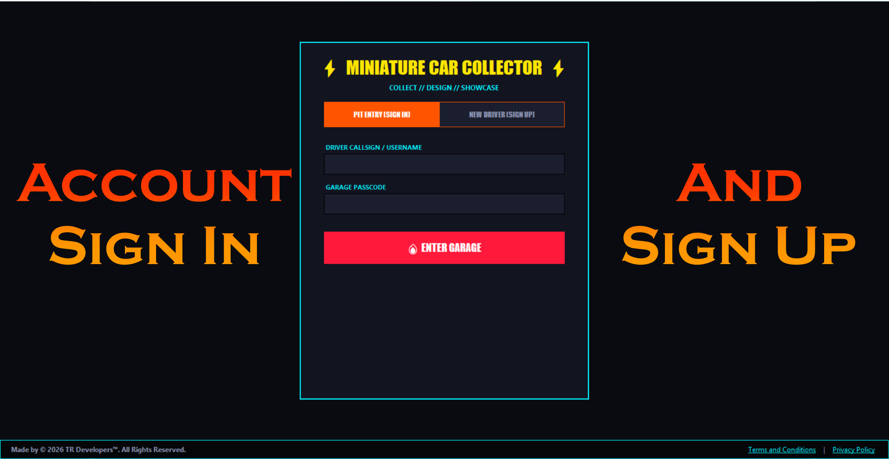
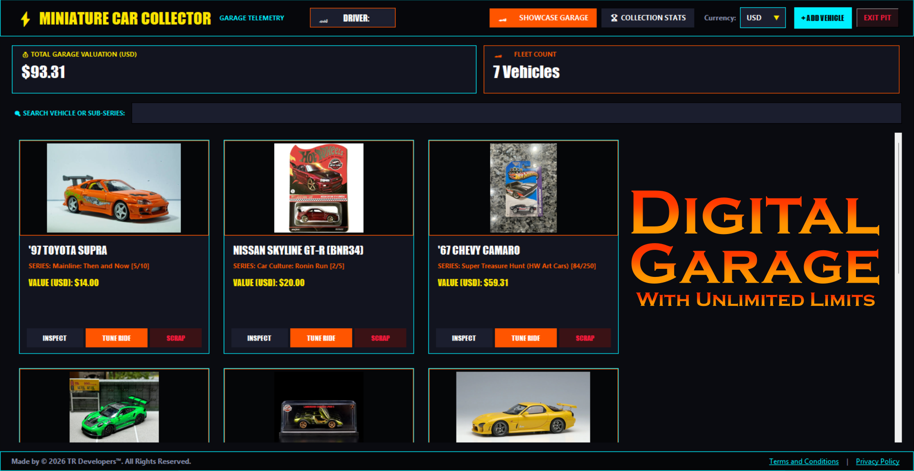
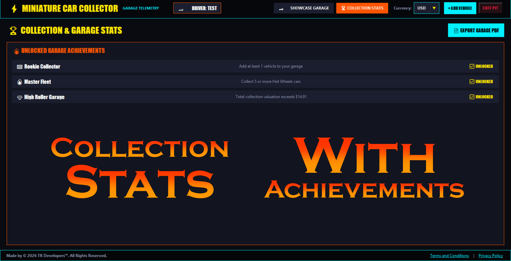
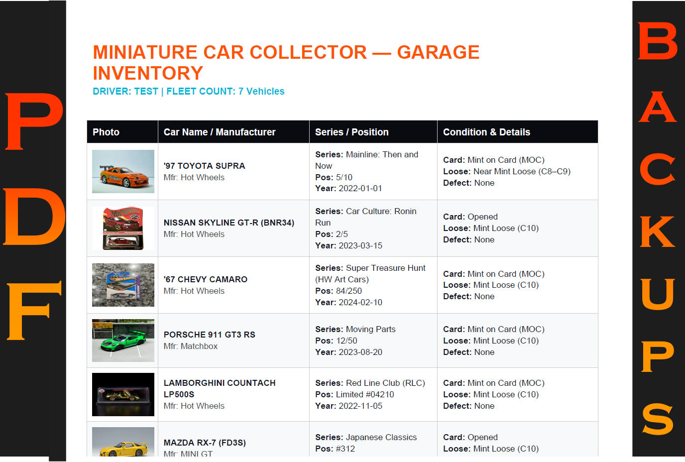

# MiniatureCarCollector

**MiniatureCarCollector** is a custom-built Windows desktop application designed for die-cast enthusiasts, hobbyists, and serious collectors to effortlessly organize, track, and manage their miniature car collections.

Whether you're organizing classic mainstream models, hunting down rare collector editions, or keeping tabs on market details, this tool provides a sleek and centralized garage management experience right on your Windows desktop.

---

## ✨ Key Features

* **Garage Inventory Management:** Easily catalog your die-cast vehicles, tracking key details, acquisition notes, and custom categories.
* **Sleek & Responsive Interface:** Built with a clean UI optimized for desktop use, complete with custom audio cues for smooth interactions.
* **Local Database Storage:** Keeps your entire collection safe and accessible locally on your PC via an embedded database backend.
* **Lightweight Setup:** Packaged into a fast, standard Windows installer with zero administrative hassle.

---

## 🛠️ How to Install

Installing **MiniatureCarCollector** is quick and straightforward:

1. Go to the **[Releases](../../releases)** tab on the right side of this repository.
2. Download the latest **`MiniatureCarCollector_Setup.exe`**.
3. Double-click **`MiniatureCarCollector_Setup.exe`** and follow the setup wizard.
4. Launch the application straight from your **Start Menu** or **Desktop shortcut**!

> **Note:** The application installs to your user folder, so **no Administrator privileges or custom security certificates are required**.

---

## 📜 Legal & Privacy

For full legal terms and privacy information, please visit our official documentation site:
* 🔗 [MiniatureCarCollector Legal & Privacy Policy](https://ranthe-hub.github.io/miniature-car-collector-legal/)

---

## 📸 Screenshots

---

Have a feature request or found a bug? Open an Issue!

---
Developed with ❤️ by **TR Developers**
